<h1 align="center">Amatta</h1>

<p align="center">
  <i>아마따 — from the Korean <b>“아, 맞다!”</b> (“oh, right!”) — that split-second a busy parent
  remembers the pickup, the permission slip, the gym kit they almost forgot. The app exists to make
  that moment happen <i>before</i> it's too late, not after.</i>
</p>

<h3 align="center">See where all your kids are, at a glance.</h3>

<p align="center">
  A local-first mobile app that turns up to <b>4 children's</b> tangled academy &amp; school
  schedules into a single <b>child × time grid</b> — so a parent can see who's where, when,
  in one screen.
</p>

<p align="center">
  <code>Expo 54</code> · <code>React Native 0.81 (new arch)</code> · <code>TypeScript strict</code> ·
  <code>SQLite (local-only)</code> · <code>0 servers</code> · <code>pre-launch · QA in progress</code>
</p>

<p align="center">
  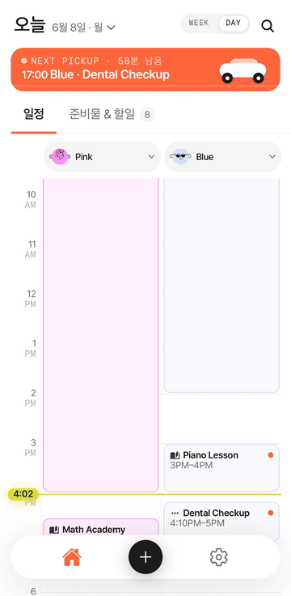
</p>

**My role.** The original idea and the core child × time-grid concept came from my collaborator
[@hugh-lee-hs](https://github.com/hugh-lee-hs). From there I designed the rest of the product — the UX, the prep-item checklists,
the pickup banner & carousel, onboarding — plus the design system, the architecture, and the full
implementation. The UI is Korean (it's a Korea-market product, so screenshots are in Hangul).

---

## The problem

Parents of multiple children have no good way to **compare** their schedules. Google Calendar
distinguishes by color only — it's weak at *simultaneous comparison* ("is anyone free at 5pm?
who needs picking up first?"). Paper and spreadsheets have no reminders. Amatta is built for
one parent, on one device, in KST — **no accounts, no server, no cloud sync.**

## The core UX insight

The differentiator is the **child × time grid**: `06:00–23:00`, 30-minute slots, up to 4 kid
columns, a 6-color palette, and 4 schedule types (`school` · `academy` · `activity` · `other`).

This is an **information-density / simultaneous-comparison** design decision: instead of one
calendar per child (sequential reading), every child shares one time axis so conflicts, gaps,
and back-to-back pickups become *visually* obvious. The same shared-axis idea works at two zoom
levels — a single day, or a whole week.

<p align="center">
  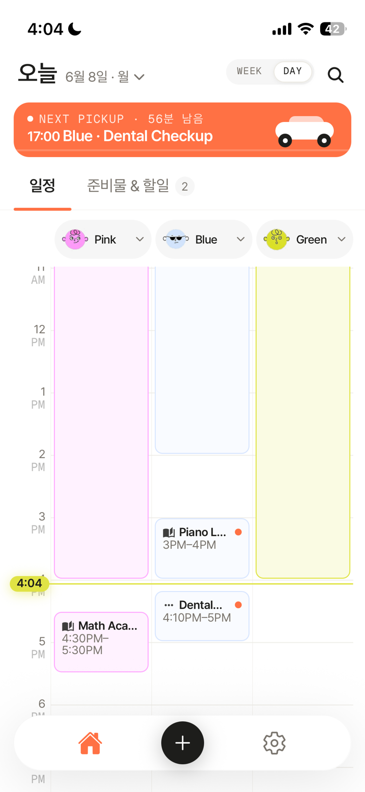
  &nbsp;&nbsp;
  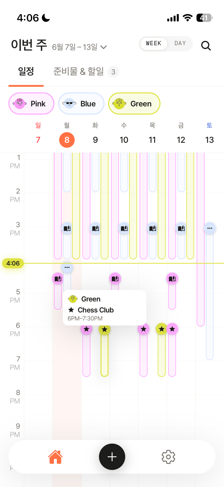
  <br/><sub><b>Daily</b> (left) and <b>weekly</b> (right) — the same shared time-axis, two zoom levels.</sub>
</p>

## Feature highlights

| | |
|---|---|
| 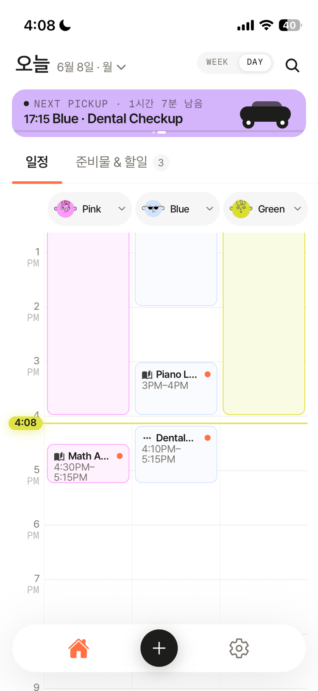 | **Pickup carousel** — surfaces the next pickup(s) as swipeable cards; conflict-aware when two pickups collide, with **no notification spam** (ADR-003). |
| 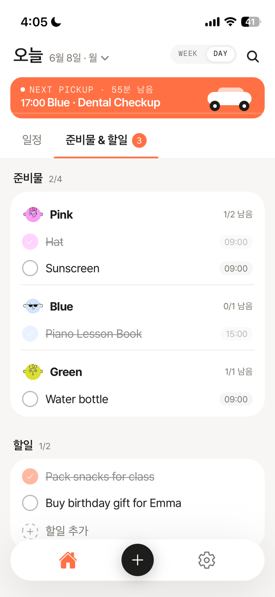 | **Todos & checklists** — the day's prep items (per child) and the parent's todos, all on one page. Per-schedule checklist items auto-prepend into that schedule's reminder (≤80 chars); todos don't fire a separate deadline alarm. |
| 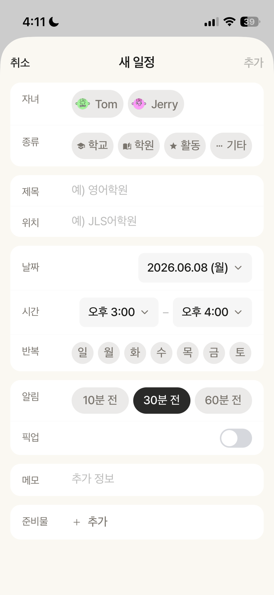 | **Fast schedule entry** — type, **weekday-repeat bitmask**, per-child reminder offset, pickup toggle, and checklist — all in one sheet. |
| 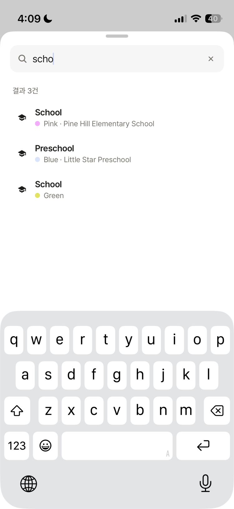 | **Search** — by child, place, or schedule name. |
| 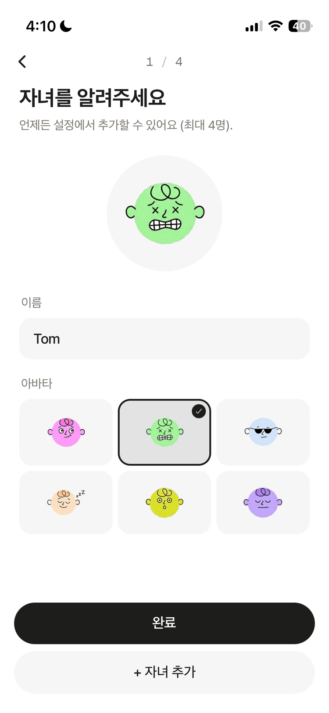 | **Onboarding** — a playful avatar picker; add up to 4 children. |
| 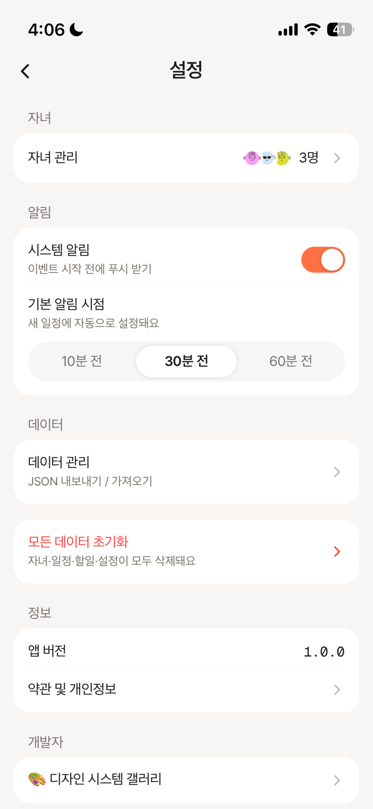 | **Data stays on device** — **JSON export/restore** instead of a cloud, plus a per-child reminder default. |

<p align="center">
  
  <br/><sub><b>Full walkthrough</b> (1.7×) — weekly view → new-schedule form (type · repeat · reminder · pickup · checklist) → search → prep &amp; todos.</sub>
</p>

## Design system

A **token-first** system, not ad-hoc styles:

- Tokens for `spacing` · `radius` · `typography` · `elevation` · `palette`.
- **13 primitives**: Text, Button, Card, Input, Fab, Pill, Badge, SelectChip, DayCircle, Toggle, DateField, DashedAddButton, Segmented.
- An **ESLint rule forbids literal colors / sizes / shadows** — every value must come from a token, enforced on every edit.
- Built to high fidelity from a reference design (`amatta-v1`), with a `__DEV__` **component gallery** for visual QA.

This is the design-engineering bridge: a consistent visual language that's *mechanically*
enforced rather than relying on discipline.

> The **UI was designed with Claude (Anthropic)** and the **illustrations — mascots & avatars —
> with Nano Banana**, then translated into enforced code tokens.

<p align="center">
  <a href="https://devlyo.github.io/amatta/design-system/">
    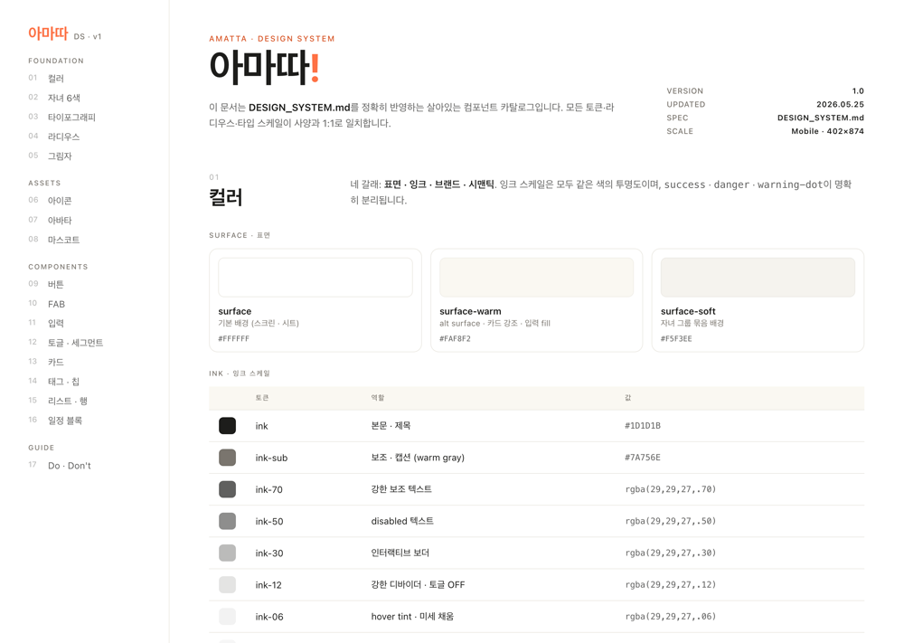
  </a>
  <br/><sub>A slice of the design system — open the interactive page:
  <a href="https://devlyo.github.io/amatta/design-system/en/"><b>English ↗</b></a> ·
  <a href="https://devlyo.github.io/amatta/design-system/"><b>한국어 ↗</b></a> ·
  <a href="docs/design/DESIGN_SYSTEM.md">token reference (markdown)</a></sub>
</p>

## Architecture & engineering

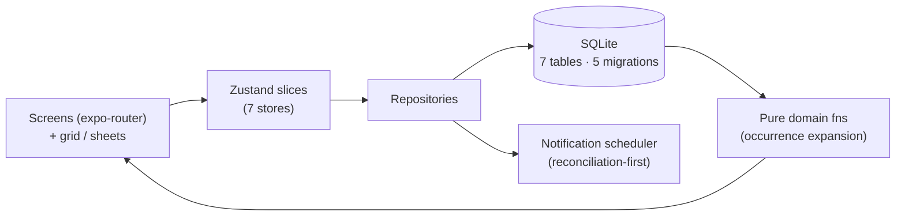

A few decisions worth calling out:

- **Local-first, zero-server.** `expo-sqlite` + raw SQL + hand-written migrations. `PRAGMA user_version`
  lives *inside* the same transaction as its DDL, so a crash mid-migration can't leave a half-applied schema.
- **Recurrence without RRULE.** A `daysOfWeek` bitmask + a single `ScheduleException` covers the ~90%
  real-world pattern ("every Mon/Wed/Fri 17:00 piano") — a deliberate simplicity call over a full iCal engine.
- **Occurrence expansion is a pure function** (`src/domain/occurrences.ts`): schedules → concrete dated
  instances for the grid, independently testable with no DB.
- **Reconciliation-first notifications.** The OS notification queue is treated as a *derived projection*
  of SQLite; `rescheduleAll()` always **cancels all first**, then re-derives a rolling N-day horizon —
  so orphan triggers from a crash or old bug can't survive.
- **Native-route modals (ADR-004).** Every sheet/modal is an `expo-router` route; `@gorhom/bottom-sheet`
  was dropped after an iOS "tap-twice-after-close" bug.

Big decisions are recorded as **ADRs** (`docs/architecture/`, ADR-001…005).

## Tech stack

| Area | Choice |
|------|--------|
| Framework | Expo SDK ~54, React Native 0.81 (new architecture) |
| Language | TypeScript — `strict` + `noUncheckedIndexedAccess` |
| Data | `expo-sqlite`, raw SQL, hand-written migrations |
| State | Zustand (per-slice, 7 stores) |
| Navigation | `expo-router` (native routes for all modals/sheets) |
| Motion / gesture | `react-native-reanimated` 4, `react-native-gesture-handler` |
| Notifications | `expo-notifications` (local only) |
| Tests | Jest + `jest-expo` + React Native Testing Library |

## How it was built

A deliberate process: a **deep-interview spec** → **ralplan consensus** (Planner / Architect /
Critic) → **ADR-driven** decisions → a phased roadmap → AI-assisted implementation. Every
significant choice is written down before it's coded. The **UI was designed with Claude (Anthropic)**,
**illustrations with Nano Banana**, and the app was built with Claude Code.

## Status & roadmap

**Pre-launch — QA in progress.** Feature-complete and in iOS App Store submission (privacy policy,
terms, and a QA checklist are prepared). On the roadmap: home-screen widgets / Live Activities,
optional cloud sync (would require a new ADR), i18n, and attendance/fee tracking.

## Run locally

This is a native Expo app (not a web app — `expo-sqlite` and `expo-notifications` are native-only,
so the `web` target exists but isn't functional). It uses native modules + a dev client, so the
first run builds the app:

```bash
npm install
npx expo run:ios       # builds the dev client and launches (or: npx expo run:android)
```

Demo data (4 kids + realistic schedules) **auto-seeds in dev builds**, so the grid is populated
on first launch.

## License

See [`LICENSE`](LICENSE).

---

<sub>아마따 (Amatta) — UI design with Claude (Anthropic), illustrations with Nano Banana, built with Claude Code. Architecture decisions in <a href="docs/architecture/">docs/architecture/</a>.</sub>
